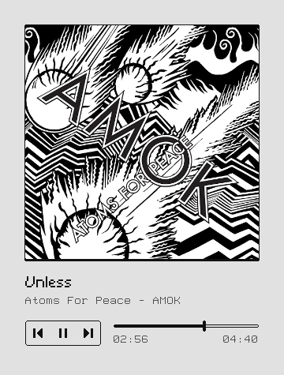
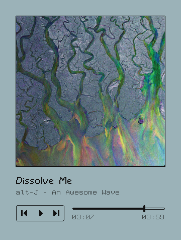

# MUPWIT - MUsic Player WIth Things

> [!WARNING]
> **WIP**! It can crush in any moment!

A small and simple [MPD](https://www.musicpd.org) client written in C99 and
[RAYLIB](https://www.raylib.com).

It is not a serious MPD client with fancy features, it was made just for fun
and learning purposes.

## Screenshots





## Building

**Dependencies**:
- raylib: 5.5
- libmpdclient: 2.23

```sh
CFLAGS=-O3 make -B
# make sure MPD server is running and a song is playing,
# otherwise it will crash :((((
./build/mupwit
```

## License

MIT license \
Do whatever you want
