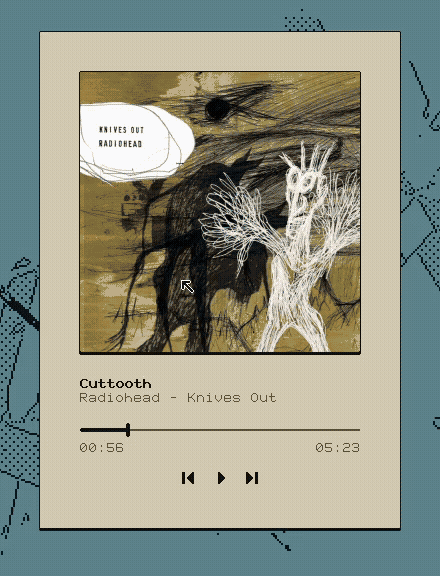
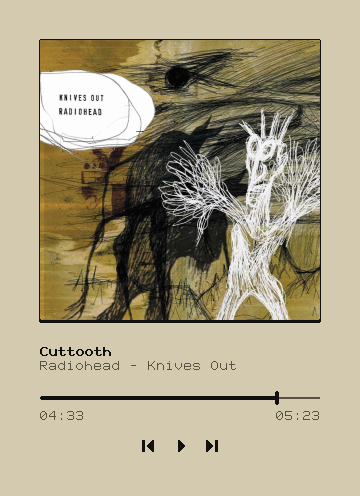
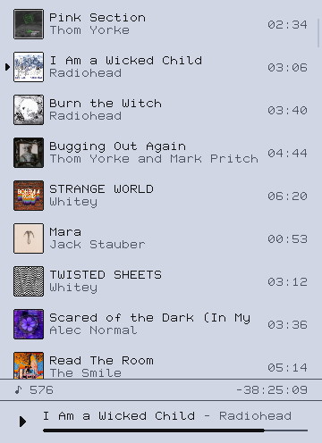
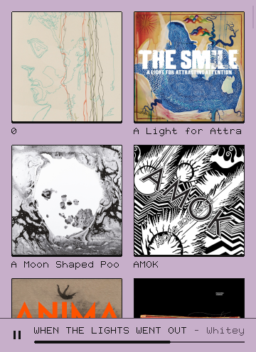

# MUPWIT - Music Player With Things

> [!WARNING]
> MUPWIT only works on **Linux Wayland**! Wayland is the only supported windowing
> backend for now. Feel free to send a pull request!
>
> Due to software-rendering nature of MUPWIT (pixels are just placed onto a
> buffer of bytes and then displayed), i don't think it will be too hard to
> add more windowing backends in the future.

A small, simple and fast software-rendered [MPD](https://www.musicpd.org)
client for pixel art people.

My little UI library, powered by [Cairo], draws the UI and displays it using my
other small low-level [Wayland client library]!

[Cairo]: https://cairographics.org/
[Wayland library]: https://github.com/bbogdan-ov/wayclient

Currently you should [build](#building) MUPWIT yourself, unfortunately.

## Features

- It looks fun ✔

## Screenshots









## Todo

**Pull requests are welcome!**

- [ ] Linux X11 support.
- [ ] Windows and Mac OS support?.. Not sure if users of these OSs even use MPD!
- [x] Current song status.
- [x] Album cover cache.
- [x] Queue screen with basic manipulations. (reodering, deletion, etc)
- [ ] Albums screen.
    - [x] List all albums.
    - [ ] Display album songs and info on click.
    - [ ] Various ways to play an album. (add to queue, play one, play random, etc)
- [ ] Playlists screen, same as albums screen.
    - [ ] Edit playlists.
    - [ ] Editing currently playing playlist from the queue.
- [ ] VIM keybinds.
- [ ] Search though lists. (albums, queue, playlists, etc)
- [ ] And more...

## Keybinds

**Global keybinds:**

| Key | Action |
|-----|--------|
| `Esc`, `Q` | Exit |
| `Tab`, `Shift-Tab` | Cycle though screens |
| `Space` | Pause/unpause |
| `>` | Next song |
| `<` | Previous song |

**Queue keybinds:**

| Key | Action |
|-----|--------|
| `Z` | Scroll to the current song |
| `G`, `Shift-G` | Scroll to the top/bottom |
| `LBM` | Play song |
| Double `RMB` | Remove song |

## Building

TODO: should statically link with `libwayland-client` and `libcairo`.

**Dependencies:**
- Odin compiler: [`dev-2026-09`](https://github.com/odin-lang/Odin/releases/tag/dev-2026-09)
- MPD: `0.24.15`
- Library `wayland`: `1.26.0`
- Library `cairo`: `1.18.4`

```sh
make
./build/mupwit
```

...or in debug mode (faster compilation)...

```sh
make DEBUG=1
./build/mupwit
```

...or without make...

```sh
odin build src -out:build/mupwit -o:speed -collection:lib=lib
```

## License

MIT license \
Do whatever you want

