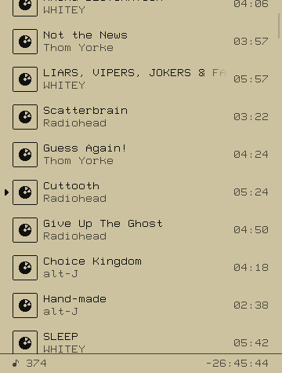

# MUPWIT - MUsic Player WIth Things

> [!WARNING]
> **WIP**! It is still kinda raw and missing some useful features, but hey, it
> is already capable of managing playback and queue, so check it out!!

> [!NOTE]
> MUPWIT is a [Music Player Daemon](https://www.musicpd.org) (MPD) client, not a self-contained music player

A small and simple [MPD](https://www.musicpd.org) client written in C99 and
[RAYLIB](https://www.raylib.com).

It is not a serious MPD client with fancy features, it was made just for fun
and learning purposes.

## Todo

- [x] Currently playing
- [ ] Queue
    - [x] List of all tracks in the queue
    - [x] Tracks reordering
    - [ ] Tracks deletion
- [ ] Keyboard controls with VIM bindings
- [ ] Albums page
- [ ] Playlists page
- [ ] Customization
- [ ] Visualizer?..

## Controls

`tab` - open queue

## Screenshots




## Building

**Dependencies**:
- raylib: 5.5
- libmpdclient: 2.23

```sh
RELEASE=1 make -B
./build/mupwit
```

## License

MIT license \
Do whatever you want
